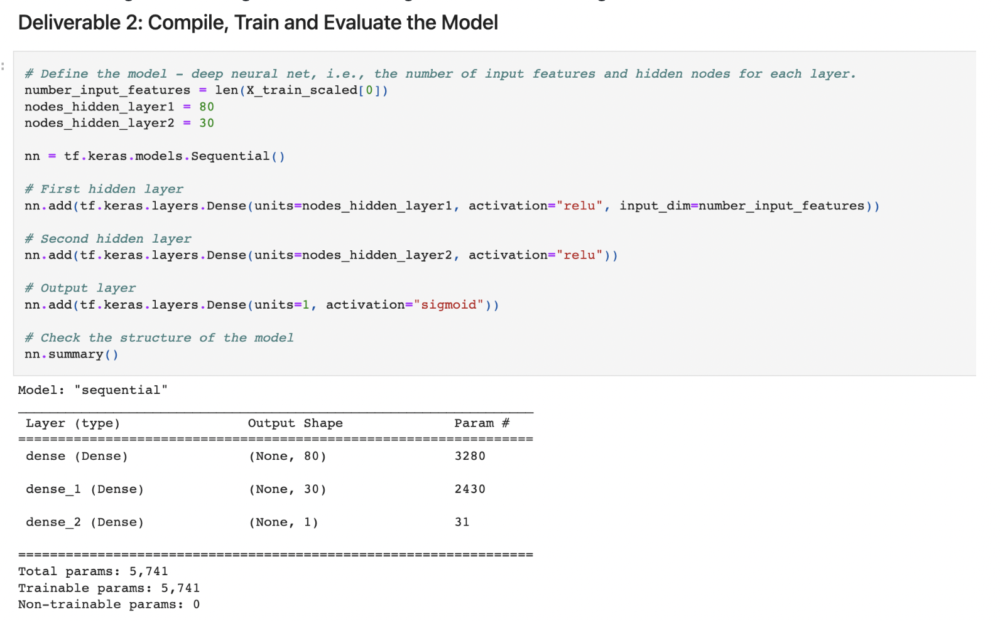

# Neural Network Charity Analysis

## Overview

The purpose of this project was to create a binary classifier to be used to preduct whether applicants will be successful if funded by Alphabet Soup. Specifically, Alphabet Soup funds chartiable organizations, and by leveraging Tensorflow, the goal of this project is to utilize input data housed in a historical spreadsheet to determine whether future chartiable organizations will be successful if funded.

## Results

The project was divided into the following areas:

### Data Preprocessing

- Target Data: Within the aforementioned dataset, the target data is the "IS_SUCCESSFUL" column, which is formatted as a binary amount (1 for "Yes", 0 for "No"). This simply is the outcome of past funding projects.

- Feature Variables: Within the dataset, the following are considered features to be used as input parameters in our model: APPLICATION_TYPE, AFFILIATION, CLASSIFICATION, USE_CASE, ORGANIZATION, STATUS, INCOME_AMT, SPECIAL CONSIDERATIONS, ASK_AMT.

- Removed Variables: Initially, the dataset contained the identification numbers and names of the organizations asking for funding. This would not have been helpful within our dataset, so the variables were dropped/removed.

### Compiling, Training, and Evaluating the Model

- Initially, the model was created with the Relu Acitivation function, as we are dealing with a complex dataset that has numerous inputs/features. Relu is generally a good starting point for complex datasets. Additionally, we created two layers. The first included 18 neurons, as there 9 features within the dataset (9x2). We added an additional layer with 9 neurons (half of the first layer).

- We set a target performance of 75%, and our model fell just short (with an accuracy level of 72.6%).

- In an attempt to increase performance, we created an auto optimzer function to calculate the best combination of layers and neurons with the optimal activation function. This only marginally increased the performance of our model, however, resulting in an accuracy of 72.7%. 

- To try to improve the performance/accuracy, the model was optimized by:
    - Adding additional hidden layer to the neural network.
    - Increasing the number of neurons for some of the hidden layers.
    - Changing the number of epochs in the training regimen.
    - Altering the activation functions of the hidden layers from 'ReLU' to 'tanh'
    - Combining these changes into one smorgus board of a training model.

## Summary

In summary, the best we were able to achieve was an accuracy score of approximately 72.7%. Given time and resource constraints, we were unable to perform an extensive analysis using the auto optimizer. In the future, we recommend adding additional epochs and potential neurons/layers to the auto optimizer function the perhaps calculate better results.

Additionally, we should take another look at the dataset and determine whether there are any outliers that may be throwing off our analysis. It would be prudent to consider removing these outliers. 

Lastly, given that we are looking for a binary results (funded or not), we should consider using a supervised leraning model to compare results, such as SVM or an ensemble model like Random Forest.
